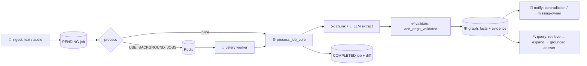

<div align="center">


# EchoGraph

### 🧠 Organizational memory with evidence.

Turn meeting notes, chat threads, emails, and audio into a **provenance-first
knowledge graph** — every fact keeps its source quote, every edge is validated,
contradictions raise alerts, and answers are grounded or explicitly abstained from.

[](https://github.com/MOHAMED-EL-HADDIOUI/EchoGraph/actions)
[](https://www.python.org/)
[](https://docs.astral.sh/ruff/)
[](#-testing--quality)
[](https://neo4j.com/)
[](#-api-tour)

*The API and developer experience are the product. No frontend — on purpose.*

</div>

---

## ✨ Why EchoGraph?

Organizations forget. Decisions made in March get re-litigated in September.
Nobody knows who owns the migration, which choice superseded which, or what
evidence supports the plan. EchoGraph captures that memory automatically:

| Ask EchoGraph | It answers, with receipts |
|---|---|
| What was decided about Project Atlas? | Ranked decisions + source quotes |
| Who owns the unresolved migration action? | Owner traversal or a missing-owner alert |
| Which decisions contradict each other? | `verdict: contradictory` + HIGH alert |
| How did the database decision evolve? | A `SUPERSEDES` timeline with evidence |
| Which questions remain unanswered? | The unresolved-questions endpoint |
| What evidence supports this claim? | Per-fact `ingestion_id` + exact quotes |

> **Core principle:** *No fact without evidence. No graph mutation without
> validation. No answer without grounding.*

---

## 🚀 Quickstart — from zero to knowledge graph in 60 seconds

```bash
cp .env.example .env
pip install -e ".[dev]"
uvicorn backend.app:app --reload
```

Open **http://localhost:8000/docs** for the interactive API. Zero Docker needed —
development runs on NetworkX + SQLite.

```bash
# 1️⃣  Ingest the Atlas standup
curl -X POST localhost:8000/ingestion -H 'Content-Type: application/json' -d '{
  "source_type": "MEETING", "title": "Atlas standup",
  "content": "Atlas standup: Sarah owns the migration to PostgreSQL. We decided to move away from MySQL by October."
}'

# 2️⃣  Extract (needs OPENAI_API_KEY) → COMPLETED + diff + notifications
curl -X POST localhost:8000/ingestion/<job_id>/process

# 3️⃣  Ask with evidence
curl -X POST localhost:8000/graph/query -H 'Content-Type: application/json' \
  -d '{"query": "migration owner", "include_evidence": true}'

# 4️⃣  Trace any fact to its source
curl localhost:8000/graph/nodes/<node_id>/lineage
```

Prefer to look before you leap? `POST /ingestion/{id}/dry-run` previews the
exact diff **without mutating anything**. Reprocessing a finished job is a safe
no-op.

---

## 🏗️ How it works



### 🧬 Extraction pipeline

`raw content → validation → chunking (overlap + IDs) → LLM strict-JSON →
Pydantic validation → normalization → merge → validated edges → notifications`

- Malformed payloads, empty titles, and unsupported quotes are **recorded as
  errors, never fatal** — one bad record can't nuke a chunk.
- Quotes are **verified against the source chunk**; invented quotes are dropped.
- Source text is **untrusted data** (SYSTEM / TASK / CONTRACT-separated prompts).
- Same `(source, type, target)` triples **merge evidence** instead of duplicating.

### 🕸️ Graph model — 13 node types · 14 edge types

`PERSON TEAM ORGANIZATION PROJECT MEETING MESSAGE EVENT TOPIC DOCUMENT DECISION
RATIONALE QUESTION ACTION_ITEM` — linked by `DECIDES DECIDED_BY OWNS ASSIGNED_TO
PART_OF MENTIONS DISCUSSES RELATES_TO CONTRADICTS SUPERSEDES BLOCKED_BY
REFERENCES DERIVED_FROM ANSWERS` (`RELATES_TO` intentionally open-schema).

---

## 🎛️ API tour

| Area | Highlights |
|---|---|
| Graph | CRUD + merge/update, search, paginated listing, validated edges, edge delete, neighbors, subgraphs (depth 1–5), export, lineage, history timelines, statistics |
| Query | `POST` + `GET /graph/query` with type/ingestion filters, verdicts, `[Title]` citations, evidence items, retrieval debug |
| Ingestion | submit → process (sync or 202 background) → dry-run → transcribe audio → idempotent retries with run history |
| Intelligence | contradiction + missing-owner (+ experimental stale) alerts with severity, evidence IDs, per-ingestion dedupe |
| Ops | public `/health`, dependency-aware `/ready`, `X-API-Key` auth, request IDs |

Full contract table with every status code → [`docs/api.md`](docs/api.md).

---

## 🧪 Testing & quality

```bash
ruff check . && ruff format --check .   # lint + format
pytest -q                               # 100+ hermetic tests (fakes only, zero network)
python -m echograph.eval                # 11/11 recorded eval cases → reports/eval.json
python -m echograph.eval --provider live  # explicit real-LLM run (spends credits)
```

- **Evaluation-driven:** node/edge precision-recall, owner/decision/contradiction
  recall, fabrication + unsupported-quote detection. Perfect-scores-or-fail gate
  runs in CI. *Fixture scores prove determinism, not live quality.*
- **Dual-backend contracts:** the same suite runs on NetworkX *and* Neo4j
  (Neo4j spins up as a CI service) — production can't silently drift from dev.
- **Failure injection:** timeouts, malformed LLM output, dead embeddings/Redis/DB/Neo4j,
  transcription outages, plus an Alembic downgrade round-trip test.

---

## 🐳 Deploy

```bash
docker compose up --build                    # api only (SQLite + NetworkX)
docker compose --profile full up --build     # + postgres, redis, neo4j, worker
```

Production env: `GRAPH_BACKEND=neo4j`, `DATABASE_URL=postgresql+asyncpg://…`,
`USE_BACKGROUND_JOBS=true`, `API_KEY=…`, then `alembic upgrade head`.
Worker: `celery -A backend.worker:celery_app worker --queues=echograph`
(append `--pool=solo` on Windows).

---

## ⚙️ Configuration

Everything lives in one settings object — see [`.env.example`](.env.example)
for the full reference: models per task (`OPENAI_EXTRACTION_MODEL`,
`OPENAI_ANSWER_MODEL`), prompt versions (recorded in run metadata + eval
reports), chunking (`CHUNK_SIZE`/`CHUNK_OVERLAP`/`MAX_CHUNKS`), timeouts, caps,
embedding-dedupe and cache flags, transcription provider, Celery toggle.

---

## 🗺️ Roadmap

Live-LLM quality measurement on real transcripts → embedding dedupe by default →
richer temporal queries → optional vector index → (much later) a UI. The guiding
rule stays: **small enough to understand, strong enough to trust, modular enough
to extend.**

---

## 📚 Go deeper

- [`docs/architecture.md`](docs/architecture.md) — pipeline, diagrams, invariants
- [`docs/graph-model.md`](docs/graph-model.md) — types, evidence, temporal lifecycle
- [`docs/evaluation.md`](docs/evaluation.md) — metrics, adding cases, prompt workflow
- [`docs/operations.md`](docs/operations.md) — Docker, workers, migrations, troubleshooting
- [`docs/security.md`](docs/security.md) — auth, limits, injection defense
- [`docs/development.md`](docs/development.md) — setup, conventions
- [`AGENTS.md`](AGENTS.md) — contributor/agent playbook

<div align="center">

*Built API-first. Tested hermetically. Measured relentlessly.* 🕸️

</div>
