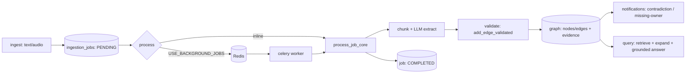
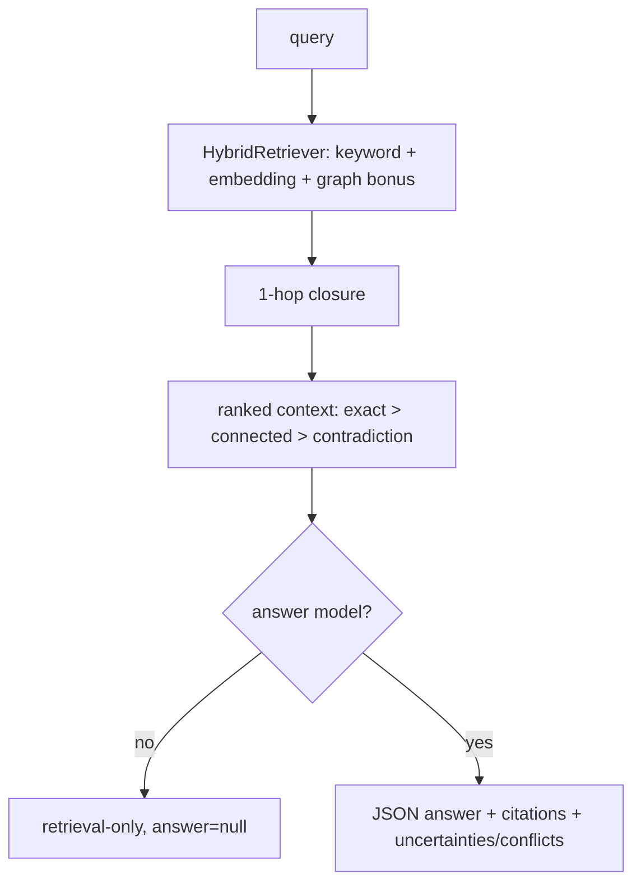

# Architecture





```
ingest → extract → validate → graph → notify → query
```

## Flow

1. **Ingest** (`POST /ingestion`, `POST /ingestion/transcribe`): raw content is
   stored on an `ingestion_jobs` row as PENDING. Nothing is extracted yet.
2. **Extract** (`POST /ingestion/{id}/process`, `services/extraction.py`): the
   transcript is chunked and each chunk goes to the LLM as strict JSON
   (`ExtractedNode`: type/title/content/confidence/quote). Malformed payloads,
   empty titles, and over-long chunks are recorded as errors, never raised.
3. **Validate** (`services/graph_ops.py::add_edge_validated`): endpoints must
   exist and the `(source, edge, target)` triple must satisfy `VALID_EDGES`
   (`RELATES_TO` is open-schema). This is the single choke point for edge
   writes — routes and future workers must use it.
4. **Graph** (`GraphManager` ABC): NetworkX (dev, JSON file) or Neo4j (prod,
   JSON-stringified `metadata`/`evidence`, embeddings round-tripped). Every
   node carries `evidence[]` (`ingestion_id` + source `quote`); every edge
   carries `ingestion_id` + quote. Merges append provenance, deduplicated by
   `(ingestion_id, quote)`.
5. **Notify** (`services/notifications.py`): deterministic rules over fresh
   extractions — CONTRADICTS edge → HIGH contradiction; ownerless
   ACTION_ITEM/DECISION → MEDIUM missing-owner. Deduped per ingestion against
   unread notifications.
6. **Query** (`POST /graph/query`, `services/query.py`): keyword retrieval with
   edge closure; optional grounded LLM answer (cites `[Title]`, abstains without
   context); `verdict` ∈ supported/uncertain/contradictory;
   `include_evidence=true` returns citable provenance items.

## Key modules

| Path | Role |
|---|---|
| `backend/app.py` | `create_app()`, lifespan (DB + graph), auth, request IDs |
| `backend/deps.py` | Injectable seams: graph, DB, LLM complete/answer, embedder, transcriber |
| `backend/services/` | `extraction`, `query`, `notifications`, `graph_ops`, `transcription`, `evaluation` |
| `backend/graph/` | `GraphManager` ABC + NetworkX/Neo4j backends + `VALID_EDGES` schema |
| `backend/obs.py` | Request IDs, structured log events, content fingerprints |
| `echograph/eval.py` | Offline eval CLI over `eval/cases/*.json` → `reports/eval.json` |

## Invariants

- No edge write bypasses `add_edge_validated()`.
- No fact without provenance: empty titles rejected, unknown edge endpoints
  skipped, quotes stored verbatim or left empty — never invented.
- Tests are hermetic: every external service (LLM, embeddings, Whisper,
  Neo4j, Postgres) is injected via `app.dependency_overrides`.
